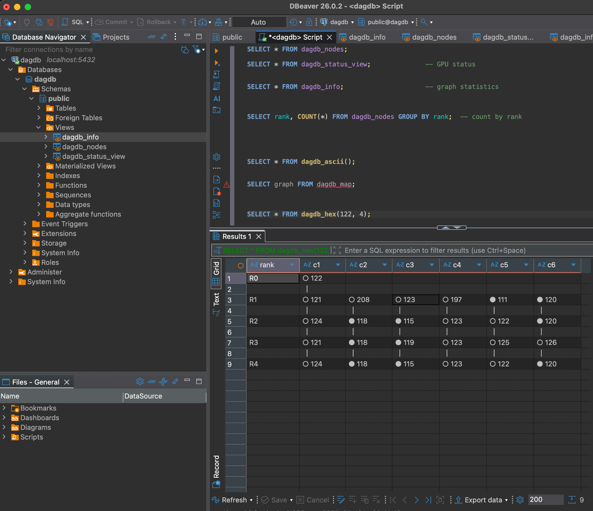

# DagDB Engine

6-bounded ranked DAG database engine. Swift + Metal GPU compute on Apple Silicon.

[→ DagDB Overview (24 slides)](https://norayr-m.github.io/DagDB/) | [→ SQL Architecture (26 slides)](https://norayr-m.github.io/DagDB/sql-architecture.html) | [→ Interview Podcast (8 min)](https://norayr-m.github.io/DagDB/podcast-interview.html) | [→ Full Podcast (30 min)](https://norayr-m.github.io/DagDB/podcast.html) | [→ Grid Demo](https://norayr-m.github.io/DagDB/grid-demo.html) | [→ City Demo](https://norayr-m.github.io/DagDB/citydrt.html)

## What It Does

Every node connects to at most **6 directed edges**. Each node has a programmable **LUT6** (64-bit lookup table) that can implement any Boolean function of its 6 inputs. Nodes are organized in **ranks** (leaves to root) and evaluated leaves-up in parallel on the GPU.

## Architecture

```
DagDB/
├── Sources/
│   ├── DagDB/                    (core library)
│   │   ├── DagDBEngine.swift     (Metal GPU engine)
│   │   ├── DagDBState.swift      (node state buffers + LUT6 presets)
│   │   ├── DagDBGraph.swift      (graph builder: hub split, ghost nodes)
│   │   ├── DagDBEngine+Graph.swift (micro-time resonance, Paradox Horizon)
│   │   ├── DagDBDelta.swift      (Carlos Delta persistence, time-travel)
│   │   ├── HexGrid.swift         (Morton Z-curve, 7-coloring)
│   │   └── Shaders/dagdb.metal   (LUT6 + weighted tick kernels)
│   │
│   ├── DagDBDaemon/              (GPU daemon server)
│   │   ├── main.swift            (socket listener + shared memory)
│   │   ├── SocketServer.swift    (Unix domain socket)
│   │   └── DSLParser.swift       (graph query DSL)
│   │
│   └── DagDBCLI/main.swift       (test harness)
│
├── pg_dagdb/                     (PostgreSQL extension, Rust/pgrx)
│   ├── Cargo.toml
│   └── src/lib.rs                (dagdb_exec SQL function)
│
└── Tests/DagDBTests/             (27 tests, all pass)
```

## Quick Start

```bash
git clone https://github.com/norayr-m/dagdb-engine.git
cd dagdb-engine
./install.sh
```

That's it. Builds, tests, starts the daemon, runs a smoke test.

### Start

**Start with the included sample database:**

```bash
./dagdb start --data sample_db/
```

This loads a power grid graph (18 sensors, 3 zones, 3 injected faults). Ready to query immediately.

### Query

```bash
./dagdb query 'STATUS'
./dagdb query 'TICK 100'
./dagdb query 'GRAPH INFO'
./dagdb query 'NODES AT RANK 3'
./dagdb query 'TRAVERSE FROM 122 DEPTH 3'
```

### Stop

**Stop the daemon** (saves state, cleans up):

```bash
./dagdb stop
```

### Other Options

```bash
./dagdb start                        # empty graph, default settings
./dagdb start --grid 512             # larger grid (262K nodes)
./dagdb start --data my_project/     # your own data folder
./dagdb status                       # is it running? show graph info
./dagdb restart                      # stop + start
./dagdb log                          # view daemon log
```

### Query via netcat (no dependencies)

```bash
echo 'STATUS' | nc -U /tmp/dagdb.sock
echo 'TICK 10' | nc -U /tmp/dagdb.sock
echo 'GRAPH INFO' | nc -U /tmp/dagdb.sock
echo 'SET 0 RANK 3' | nc -U /tmp/dagdb.sock
echo 'SET 0 TRUTH 1' | nc -U /tmp/dagdb.sock
echo 'SET 0 LUT AND' | nc -U /tmp/dagdb.sock
echo 'CLEAR 0 EDGES' | nc -U /tmp/dagdb.sock
echo 'CONNECT FROM 1 TO 0' | nc -U /tmp/dagdb.sock
echo 'NODES AT RANK 3' | nc -U /tmp/dagdb.sock
echo 'TRAVERSE FROM 0 DEPTH 2' | nc -U /tmp/dagdb.sock
```

No PostgreSQL needed. No Rust needed. Just Swift and netcat.

## SQL Access (Optional, Advanced)

If you want SQL access via PostgreSQL, you need PostgreSQL 17 and Rust installed. See `pg_dagdb/` directory for the pgrx extension. The daemon must be running first.

Start the daemon first, then run the installer:

```bash
# Terminal 1: start daemon
.build/debug/dagdb-daemon --grid 256

# Terminal 2: install Postgres extension
./install_postgres.sh
```

The script installs Rust, PostgreSQL 17, pgrx, builds the extension, creates the database, and tests everything. One command.

**⚠️ Do NOT run `cargo build` in pg_dagdb/.** It will fail with linker errors. pgrx extensions must use `cargo pgrx install`.

Once installed, connect and query (daemon must be running):

```sql
psql dagdb

SELECT * FROM dagdb_exec('STATUS');
SELECT * FROM dagdb_exec('TICK 100');
SELECT * FROM dagdb_exec('NODES AT RANK 2 WHERE truth=1');
SELECT * FROM dagdb_exec('TRAVERSE FROM 42 DEPTH 3');
SELECT * FROM dagdb_exec('GRAPH INFO');
SELECT * FROM dagdb_exec('SET 0 TRUTH 1');
SELECT * FROM dagdb_exec('EVAL');
```

## Connect with DBeaver (or any SQL client)

DagDB sits behind PostgreSQL, so any SQL client works — DBeaver, DataGrip, pgAdmin, Python, etc.

**Install DBeaver** (free, open source):

```bash
brew install --cask dbeaver-community
```

**Connect:**

1. Open DBeaver → New Connection → **PostgreSQL**
2. Host: `localhost`, Port: `5432`, Database: `dagdb`
3. Username: your macOS username, Password: (leave blank)
4. Click **Test Connection** → should say "Connected"
5. Click **Finish**

**Query:**

Open a SQL editor (right-click connection → SQL Editor) and run:

```sql
SELECT * FROM dagdb_exec('STATUS');
SELECT * FROM dagdb_exec('TICK 100');
SELECT * FROM dagdb_exec('NODES AT RANK 2 WHERE truth=1');
SELECT * FROM dagdb_exec('TRAVERSE FROM 42 DEPTH 3');
```

Results show up in DBeaver's table grid. Works with any tool that speaks PostgreSQL — Python (`psycopg2`), Node.js (`pg`), Go (`lib/pq`), JDBC, ODBC.

**Set up views and visualizations:**

```bash
psql dagdb -f setup_views.sql
```

This creates views and functions that show up as clickable objects:

```sql
SELECT * FROM dagdb_nodes;                    -- browse all nodes
SELECT * FROM dagdb_status_view;              -- GPU status
SELECT * FROM dagdb_info;                     -- graph statistics
SELECT * FROM dagdb_run(10);                  -- tick 10 times
SELECT * FROM dagdb_rank(2);                  -- nodes at rank 2
SELECT * FROM dagdb_traverse(42, 3);          -- walk from node 42
SELECT rank, COUNT(*) FROM dagdb_nodes GROUP BY rank;  -- count by rank
SELECT * FROM dagdb_ascii();                          -- ASCII art schema
SELECT * FROM dagdb_show();                           -- LIVE graph with values
```

**`dagdb_hex(node, depth)`** — the hex DAG as a 6-column table:



**`dagdb_show()`** — the star of the show. Full ASCII visualization with real node IDs, truth values, LUT gate types, edge connectivity, fault list, zone health ratios, and aggregation logic. All live from the GPU daemon:

```
  NORTH          SOUTH           EAST
  100:● 101:● 102:●  106:● 107:● 108:●   112:● 113:● 114:○
  103:● 104:● 105:●  109:○ 110:● 111:●   115:● 116:○ 117:●

  FAULTS: 109 114 116
  NORTH: 6/6 healthy  →  AND  → ●
  SOUTH: 6/5 healthy  →  MAJ  → ●  (need 4+)
  EAST:  6/4 healthy  →  OR   → ●  (need 1+)
  GRID:  3 zones → AND → ○   DECISION: ○
```

## Test Results

```
27/27 tests pass
1K nodes: 0.45 ms/tick
1M nodes: 0.71 GCUPS
All 7 verification gates: GREEN
```

## Requirements

- macOS 14+ (Sonoma)
- Apple Silicon (M1/M2/M3/M4/M5)
- Swift 5.9+
- PostgreSQL 17 + Rust (for pg_dagdb extension, optional)

## Humble Disclaimer

This is an amateur engineering project. We are not HPC or database professionals and make no competitive claims. Numbers speak; ego does not. Errors likely.
