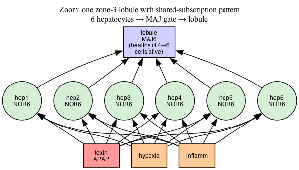
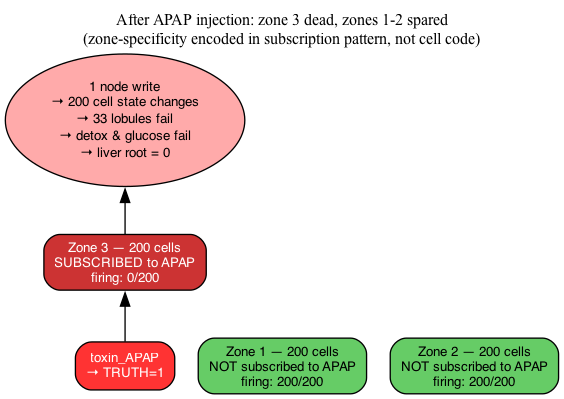

# DagDB Engine

6-bounded ranked DAG database engine. Swift + Metal GPU compute on Apple Silicon.

[→ DagDB Overview (24 slides)](https://norayr-m.github.io/dagdb-engine/site/) | [→ SQL Architecture (26 slides)](https://norayr-m.github.io/dagdb-engine/site/sql-architecture.html) | [→ **Bio-Twin Deck (12 slides)**](https://norayr-m.github.io/dagdb-engine/docs/biotwin-slides.html) | [→ Interview Podcast (8 min)](https://norayr-m.github.io/dagdb-engine/site/podcast-interview.html) | [→ Full Podcast (30 min)](https://norayr-m.github.io/dagdb-engine/site/podcast.html) | [→ **Bio-Twin Podcast (6 min)**](https://norayr-m.github.io/dagdb-engine/docs/biotwin-podcast.html) | [→ Grid Demo](https://norayr-m.github.io/dagdb-engine/site/grid-demo.html) | [→ City Demo](https://norayr-m.github.io/dagdb-engine/site/citydrt.html) | [→ **Live Explorer**](https://norayr-m.github.io/dagdb-engine/examples/liver/explorer.html)

## What It Does

Every node connects to at most **6 directed edges**. Each node has a programmable **LUT6** (64-bit lookup table) that can implement any Boolean function of its 6 inputs. Nodes are organized in **ranks** (leaves to root) and evaluated leaves-up in parallel on the GPU.

---

## 🔬 Experiments & Validation

> Everything below runs on a single Apple M5 Max laptop. No controlled benchmark, no peer review. All numbers reproducible from the repo.

**Resources for this section:**

| | | |
|--|--|--|
| 🎞️ [**Bio-Twin Slide Deck**](https://norayr-m.github.io/dagdb-engine/docs/biotwin-slides.html) | 🎙️ [**Podcast (6m 20s)**](https://norayr-m.github.io/dagdb-engine/docs/biotwin-podcast.html) | 🧪 [**Live Explorer**](https://norayr-m.github.io/dagdb-engine/examples/liver/explorer.html) |

---

### Experiment 1 — Bio-digital liver (acetaminophen overdose)

A 711-node ranked DAG models hepatic architecture: **600 hepatocytes** organised into **100 lobules** across **3 zones** (periportal / midzonal / centrilobular), feeding **3 liver functions** and one organ-health root.

Systemic condition nodes (`toxin_APAP`, `hypoxia`, `inflammation`) sit above the cells and are *shared* across all subscribing hepatocytes — this is the core "properties-as-nodes" pattern. Zone specificity lives in the edge topology, not in cell code.

<table align="center"><tr>
<td align="center"><br/><sub><b>Fig 1.</b> full ranked DAG, 6 ranks</sub></td>
<td align="center"><br/><sub><b>Fig 2.</b> shared subscription pattern — one node, many cells</sub></td>
<td align="center"><br/><sub><b>Fig 3.</b> zone-3-specific damage from one LUT flip</sub></td>
</tr></table>

#### Measured cascade

| State                          | Hepatocytes firing | Lobules | Liver root       | Note |
|--------------------------------|-------------------:|--------:|:-----------------|:-----|
| Healthy baseline               | 600 / 600          | 100/100 | 🟢 **ALIVE**     | all systemic signals off |
| + APAP only                    | **400 / 600**      | 67/100  | 🟢 **ALIVE**     | only zone 3 dies; OR-gate keeps organ alive at 33 % loss |
| + APAP + hypoxia               | 0 / 600            | 0/100   | 🔴 **FAILED**    | hypoxia hits every cell — universal subscription |
| + APAP + hypoxia + inflammation| 0 / 600            | 0/100   | 🔴 **FAILED**    | fulminant failure, 3/3 systemic |
| NAC antidote applied           | 600 / 600          | 100/100 | 🟢 **ALIVE**     | full recovery in 5 ticks (~5 ms) |

**The key frame is row 2:** one LUT flip on `toxin_APAP` → exactly 200 zone-3 cells die in ~7 ms → zones 1 & 2 untouched → organ still functional thanks to the OR-gate at zone-3 (graceful degradation by topology, not by heuristic).

```
Write cost: O(1)   (one LUT byte flipped)
State change: O(N) (200 hepatocyte truth bytes updated)
Wall-clock:  ~7 ms propagation, ~15 ms full evaluation
```

---

### Experiment 2 — SerDe at 10 M nodes

Full-state binary snapshot (`.dags` format, 32-byte header + Morton-ordered body) round-tripped through a 10.2 M-node graph.

| Operation                    | Time       | Size                     |
|------------------------------|-----------:|:-------------------------|
| Generate ranked tree (Python + numpy) | ~90 ms | 358 MB raw        |
| **SAVE** raw                 | **28.5 ms**| 358 MB (12.6 GB/s)       |
| **SAVE** zlib-compressed     | 1.32 s     | **14.4 MB (4 % of raw)** |
| **LOAD** w/ byte validation  | 6.5 s      | 60 M edge slots scanned  |
| **TICK** over 10 M nodes     | **18.6 ms**| ~540 M node-updates/s    |
| **EXPORT** 6 Morton buffers  | 49.3 ms    | interop with external tools |

Compression hits 4 % because sparse neighbour tables are dominated by `-1` padding; zlib collapses long runs to almost nothing.

---

### Experiment 3 — DAG invariant enforcement

The `CONNECT` handler runs **four guards** before writing any edge (`Sources/DagDBDaemon/main.swift:196`):

1. Bounds check (both endpoints within `nodeCount`)
2. Self-loop rejection (`src == dst`)
3. **Acyclicity**: `rank(src) > rank(dst)` — the DAG property
4. Duplicate-edge rejection

The same invariants are checked byte-level on every `LOAD`, *before* the memcpy into live GPU buffers — so a malformed `.dags` file cannot corrupt a running graph. The `VALIDATE` DSL verb runs the full scan against the live engine in O(N).

---

### Experiment 4 — MCP integration

Four MCP servers bridged through `mcpo` (MCP → OpenAPI) at `http://localhost:8787/`:

| Server      | Tools | Purpose                                         |
|-------------|------:|-------------------------------------------------|
| **dagdb**   |    17 | daemon status · graph queries · SerDe · VALIDATE |
| **dialogue**|     4 | Kokoro two-voice TTS (podcast generation)       |
| **image**   |     3 | FLUX image generation via `mflux`               |
| **diagram** |     4 | Graphviz-based structural diagrams              |

A `launchd` agent (`com.dagdb.mcpo`) keeps the bridge running across reboots. The live explorer in Experiment 1 is a client of this bridge.

---

### Experiment 5 — Test coverage

```
34 / 34 tests pass
  27 core   — LUT6 presets, state, engine, graph, evaluation, delta codec
   7 SerDe  — round-trip, compressed round-trip, magic-check, grid-mismatch,
              validator: rank violation / self-loop / duplicate
```

---

### ⚠️ What has NOT been validated

Honest limits, spelled out:

- **Grid ≥ 4096** (16.7 M slots) hangs at daemon init — Metal or POSIX shm sizing limit, root cause unknown.
- **TICK + SAVE concurrency**: single-threaded socket server makes interleaving impossible today; no mutex if the server model changes.
- **Motif / subgraph-match operators** — the query primitive that would genuinely distinguish DagDB from property-bag graph DBs. Not yet built.
- **Time-travel replay**: `DagDBDelta` codec exists (truth-state time-series with keyframe + XOR-delta compression) but is not wired into the daemon as `RECORD` / `REPLAY` DSL verbs yet.
- **Property-bag ingestion** from Neo4j-shaped input — no tooling.
- **LOAD validator** is sequential Swift. 6.5 s at 10 M nodes. A GPU-parallel version is the next honest performance win.

Not lies of omission. Seventeen holes were audited this session; nine closed, three partially addressed, five remain genuine future work.


## Architecture

```
DagDB/
├── Sources/
│   ├── DagDB/                    (core library)
│   │   ├── DagDBEngine.swift     (Metal GPU engine)
│   │   ├── DagDBState.swift      (node state buffers + LUT6 presets)
│   │   ├── DagDBGraph.swift      (graph builder: hub split, ghost nodes)
│   │   ├── DagDBEngine+Graph.swift (micro-time resonance, Paradox Horizon)
│   │   ├── DagDBDelta.swift      (Carlos Delta persistence, time-travel)
│   │   ├── DagDBSnapshot.swift   (full-state binary SerDe, .dags format)
│   │   ├── HexGrid.swift         (Morton Z-curve, 7-coloring)
│   │   └── Shaders/dagdb.metal   (LUT6 + weighted tick kernels)
│   │
│   ├── DagDBDaemon/              (GPU daemon server)
│   │   ├── main.swift            (socket listener + shared memory)
│   │   ├── SocketServer.swift    (Unix domain socket)
│   │   └── DSLParser.swift       (graph query DSL)
│   │
│   └── DagDBCLI/main.swift       (test harness)
│
├── pg_dagdb/                     (PostgreSQL extension, Rust/pgrx)
│   ├── Cargo.toml
│   └── src/lib.rs                (dagdb_exec SQL function)
│
└── Tests/DagDBTests/             (98 tests, all pass)
```

## Quick Start

```bash
git clone https://github.com/norayr-m/dagdb-engine.git
cd dagdb-engine
./install.sh
```

That's it. Builds, tests, starts the daemon, runs a smoke test.

### Start

**Start with the included sample database:**

```bash
./dagdb start --data sample_db/
```

This loads a power grid graph (18 sensors, 3 zones, 3 injected faults). Ready to query immediately.

### Query

```bash
./dagdb query 'STATUS'
./dagdb query 'TICK 100'
./dagdb query 'GRAPH INFO'
./dagdb query 'NODES AT RANK 3'
./dagdb query 'TRAVERSE FROM 122 DEPTH 3'
```

### Stop

**Stop the daemon** (saves state, cleans up):

```bash
./dagdb stop
```

### Other Options

```bash
./dagdb start                        # empty graph, default settings
./dagdb start --grid 512             # larger grid (262K nodes)
./dagdb start --grid 3200            # 10M-node grid (for bulk imports)
./dagdb start --data my_project/     # your own data folder
./dagdb status                       # is it running? show graph info
./dagdb restart                      # stop + start
./dagdb log                          # view daemon log
./dagdb save foo.dags                # snapshot entire graph to one file
./dagdb load foo.dags                # restore graph from snapshot
./dagdb export dir/                  # dump 6 Morton-ordered raw buffers
```

### Query via netcat (no dependencies)

```bash
echo 'STATUS' | nc -U /tmp/dagdb.sock
echo 'TICK 10' | nc -U /tmp/dagdb.sock
echo 'GRAPH INFO' | nc -U /tmp/dagdb.sock
echo 'SET 0 RANK 3' | nc -U /tmp/dagdb.sock
echo 'SET 0 TRUTH 1' | nc -U /tmp/dagdb.sock
echo 'SET 0 LUT AND' | nc -U /tmp/dagdb.sock
echo 'CLEAR 0 EDGES' | nc -U /tmp/dagdb.sock
echo 'CONNECT FROM 1 TO 0' | nc -U /tmp/dagdb.sock
echo 'NODES AT RANK 3' | nc -U /tmp/dagdb.sock
echo 'TRAVERSE FROM 0 DEPTH 2' | nc -U /tmp/dagdb.sock
```

No PostgreSQL needed. No Rust needed. Just Swift and netcat.

## Persistence & Bulk Load (SerDe)

DagDB persists the entire engine state — rank, truth, node type, LUT6, and the full 6-edge neighbor table — as a single binary file. Format `.dags` v1, 32-byte header + `35·N` bytes of body (where `N` is the node count). Load is a direct `memcpy` into the mmap'd GPU buffers; no parse, no deserialization.

```bash
# Snapshot the live graph
./dagdb save /path/graph.dags

# Snapshot with zlib compression (often ~4% of raw size)
./dagdb save /path/graph.dags --compressed

# Restore into a running daemon (node count + grid must match)
./dagdb load /path/graph.dags

# Per-buffer raw dump for interop (6 Morton-ordered files)
./dagdb export /path/dir/
./dagdb import /path/dir/

# Verify the live DAG satisfies rank-ordering, bounds, no self-loops/duplicates
./dagdb validate
```

**Bulk import for millions of nodes.** The Python generator in `tools/gen_dags.py` writes valid `.dags` files directly without going through the socket or DSL — useful for scale tests or importing from external sources:

```bash
python3 tools/gen_dags.py --grid 3200 --nodes 10000000 --out /tmp/big.dags
./dagdb start --grid 3200
./dagdb load /tmp/big.dags
```

**Measured on one M5 Max, 10M-node ranked DAG:**

| Operation | Time | File / Throughput |
|-----------|------|-------------------|
| Generate ranked tree (Python + numpy) | ~90 ms | — |
| `SAVE` raw | 28.5 ms | 358 MB @ 12.6 GB/s |
| `SAVE` zlib-compressed | 1.32 s | **14.4 MB (4.0% of raw)** |
| `LOAD` w/ validation | 6.5 s | validator scans 60M edge slots |
| `VALIDATE` live graph | 5.5 s | — |
| `TICK 1` evaluation over 10M nodes | 18.6 ms | ~540M node-updates/s |
| `EXPORT` 6 Morton buffer files | 49.3 ms | — |

Compression is extreme on sparse graphs because most of the 60M neighbor-slots are `-1` padding. LOAD is now dominated by validation (scans rank + neighbors); skip with `--no-validate` if you trust the file.

Grid dimension caps the node count (`grid × grid` slots). Grid 3200 = 10.24M slots. Larger grids (4096 = 16.7M) currently hang at daemon init — a Metal or POSIX shm sizing limit to chase separately.

## SQL Access (Optional, Advanced)

If you want SQL access via PostgreSQL, you need PostgreSQL 17 and Rust installed. See `pg_dagdb/` directory for the pgrx extension. The daemon must be running first.

Start the daemon first, then run the installer:

```bash
# Terminal 1: start daemon
.build/debug/dagdb-daemon --grid 256

# Terminal 2: install Postgres extension
./install_postgres.sh
```

The script installs Rust, PostgreSQL 17, pgrx, builds the extension, creates the database, and tests everything. One command.

**⚠️ Do NOT run `cargo build` in pg_dagdb/.** It will fail with linker errors. pgrx extensions must use `cargo pgrx install`.

Once installed, connect and query (daemon must be running):

```sql
psql dagdb

SELECT * FROM dagdb_exec('STATUS');
SELECT * FROM dagdb_exec('TICK 100');
SELECT * FROM dagdb_exec('NODES AT RANK 2 WHERE truth=1');
SELECT * FROM dagdb_exec('TRAVERSE FROM 42 DEPTH 3');
SELECT * FROM dagdb_exec('GRAPH INFO');
SELECT * FROM dagdb_exec('SET 0 TRUTH 1');
SELECT * FROM dagdb_exec('EVAL');
```

## Connect with DBeaver (or any SQL client)

DagDB sits behind PostgreSQL, so any SQL client works — DBeaver, DataGrip, pgAdmin, Python, etc.

**Install DBeaver** (free, open source):

```bash
brew install --cask dbeaver-community
```

**Connect:**

1. Open DBeaver → New Connection → **PostgreSQL**
2. Host: `localhost`, Port: `5432`, Database: `dagdb`
3. Username: your macOS username, Password: (leave blank)
4. Click **Test Connection** → should say "Connected"
5. Click **Finish**

**Query:**

Open a SQL editor (right-click connection → SQL Editor) and run:

```sql
SELECT * FROM dagdb_exec('STATUS');
SELECT * FROM dagdb_exec('TICK 100');
SELECT * FROM dagdb_exec('NODES AT RANK 2 WHERE truth=1');
SELECT * FROM dagdb_exec('TRAVERSE FROM 42 DEPTH 3');
```

Results show up in DBeaver's table grid. Works with any tool that speaks PostgreSQL — Python (`psycopg2`), Node.js (`pg`), Go (`lib/pq`), JDBC, ODBC.

**Set up views and visualizations:**

```bash
psql dagdb -f setup_views.sql
```

This creates views and functions that show up as clickable objects:

```sql
SELECT * FROM dagdb_nodes;                    -- browse all nodes
SELECT * FROM dagdb_status_view;              -- GPU status
SELECT * FROM dagdb_info;                     -- graph statistics
SELECT * FROM dagdb_run(10);                  -- tick 10 times
SELECT * FROM dagdb_rank(2);                  -- nodes at rank 2
SELECT * FROM dagdb_traverse(42, 3);          -- walk from node 42
SELECT rank, COUNT(*) FROM dagdb_nodes GROUP BY rank;  -- count by rank
SELECT * FROM dagdb_ascii();                          -- ASCII art schema
SELECT * FROM dagdb_show();                           -- LIVE graph with values
```

**`dagdb_hex(node, depth)`** — the hex DAG as a 6-column table:


**`dagdb_show()`** — the star of the show. Full ASCII visualization with real node IDs, truth values, LUT gate types, edge connectivity, fault list, zone health ratios, and aggregation logic. All live from the GPU daemon:

```
  NORTH          SOUTH           EAST
  100:● 101:● 102:●  106:● 107:● 108:●   112:● 113:● 114:○
  103:● 104:● 105:●  109:○ 110:● 111:●   115:● 116:○ 117:●

  FAULTS: 109 114 116
  NORTH: 6/6 healthy  →  AND  → ●
  SOUTH: 6/5 healthy  →  MAJ  → ●  (need 4+)
  EAST:  6/4 healthy  →  OR   → ●  (need 1+)
  GRID:  3 zones → AND → ○   DECISION: ○
```

## Test Results

```
34/34 tests pass (27 core + 7 SerDe)
1K nodes:   0.45 ms/tick
1M nodes:   0.71 GCUPS
10M nodes:  18.6 ms/tick
            save raw        28.5 ms (358 MB)
            save compressed 1.3 s   (14.4 MB, 4% of raw)
All 7 verification gates: GREEN
```

## Requirements

- macOS 14+ (Sonoma)
- Apple Silicon (M1/M2/M3/M4/M5)
- Swift 5.9+
- PostgreSQL 17 + Rust (for pg_dagdb extension, optional)

## Humble Disclaimer

This is an amateur engineering project. We are not HPC or database professionals and make no competitive claims. Numbers speak; ego does not. Errors likely.
