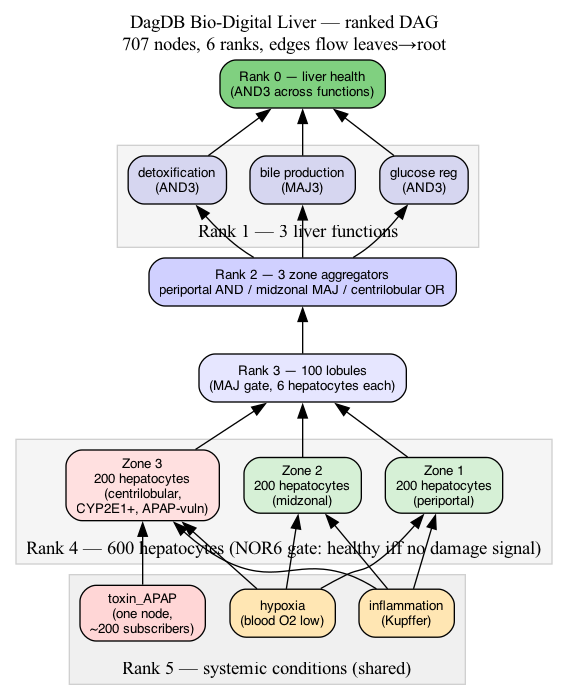

# Bio-Digital Liver on DagDB

A minimal but anatomically grounded hepatic twin: 600 hepatocytes organized
into 100 lobules, three functional zones (periportal / midzonal / centrilobular),
three core functions (detoxification, bile, glucose regulation), and one
overall liver-health output.

The purpose of this example is **not** to model the liver faithfully. It is
to demonstrate, on real physiology, that the DagDB architecture's three
constraints — ranks, ≤6-edge bound, and shared property nodes — fit the
problem naturally rather than being imposed.



## Why the liver fits a 6-bounded ranked DAG

Hepatic microarchitecture is literally a ranked graph:

| DagDB rank | Hepatic structure          | Aggregation        |
|------------|----------------------------|--------------------|
| 5          | systemic signals           | —                  |
| 4          | 600 hepatocytes            | NOR6 gate          |
| 3          | 100 lobules                | MAJ6 (4+/6 cells)  |
| 2          | 3 zones                    | AND / MAJ / OR     |
| 1          | 3 functions                | AND3 / MAJ3        |
| 0          | liver health root          | AND3               |

Each level aggregates ≤6 inputs from the level above — because that is how
the tissue actually organizes. A hepatocyte sits between at most 6 neighbor
cells; a lobule fans into at most 6 adjacent lobules via sinusoids; zonal
metabolism is a 3-way split. The 6-bound isn't a limitation here. It matches
reality.

## Properties-as-nodes: what this example demonstrates

The classical graph-DB pattern is "a node has a property bag". In DagDB,
properties are **nodes themselves**, shared across many subscribers.

Three systemic-condition nodes live at rank 5:

- `toxin_APAP` — is acetaminophen present in portal blood?
- `hypoxia` — is blood oxygen low?
- `inflammation` — is there a Kupffer-cell signal?

Hepatocytes do not store these values — they *edge into* them. Zone-3 cells
subscribe to all three. Zones 1 and 2 subscribe to only `hypoxia` and
`inflammation`; they don't know about APAP because they don't have the
edge.


**The architectural win**: flipping *one* truth byte on `toxin_APAP`
propagates to every zone-3 hepatocyte in the next tick. No per-cell write,
no broadcast loop. Population-level state change with O(1) writer cost.

## Acetaminophen toxicity scenario

Acetaminophen (APAP, paracetamol) at therapeutic dose is conjugated safely.
At overdose, excess APAP saturates conjugation and gets metabolised by
cytochrome P450 (predominantly CYP2E1) to the reactive intermediate NAPQI.
CYP2E1 is expressed mainly in centrilobular hepatocytes, so APAP damage is
**zone-specific**: zone 3 dies first.

In this graph, that zone-specificity lives in the **edge pattern**, not in
the cell's code. Zones 1 and 2 don't have an incoming edge from
`toxin_APAP`, so flipping it has zero effect on them.


**Measured at grid 256×256 on M5 Max:**

```
Baseline (healthy):
  hepatocytes firing: 600/600
  lobules: 100/100   zones: 3/3   functions: 3/3   liver root: ON

After SET toxin_APAP LUT CONST1 + 5 ticks (7.0 ms total):
  hepatocytes: 400/600  ← exactly 200 zone-3 cells died
  lobules: 67/100       ← 33 lobules failed (those aggregating zone-3 cells)
  zones: 3/3            ← zone 3 OR gate still fires on sampled zone-2 lobules
  functions: 3/3        ← not yet collapsed
  liver root: ON

After adding hypoxia (universal signal):
  ALL ranks → 0  (hepatic failure, all zones hypoxic)

After NAC antidote (systemic signals → CONST0):
  Full recovery in 5 ticks.  All ranks back to baseline.
```

One LUT flip, propagates in 7 ms across the whole graph. That's the
architecture working.

## What is NOT modelled

Honest limits of this demo:

- **Stellate cells, Kupffer cells, sinusoidal endothelium** — collapsed
  into the single `inflammation` signal. A real twin would make each a
  distinct cell type with its own LUT.
- **Spatial layout** — the Morton Z-curve places nodes in memory; we do
  not render 2-D anatomical position.
- **Kinetics** — each tick is discrete; there is no dose-response curve,
  clearance rate, or time constant. Injecting APAP is binary.
- **NAPQI, glutathione, mitochondrial state** — one-step "damaged / not
  damaged" proxy; a realistic model would make each a rank-level.
- **Regeneration** — hepatocytes cannot proliferate in this model; death
  is reversible only because we flip the systemic signal off, not because
  cells actually recover.

This is a **proof of structure**, not a clinical model. A working
bio-digital twin for real research would extend the rank hierarchy down
to molecular pathways (glutathione cycle, mitochondrial membrane
potential, caspase cascade) and up to whole-organ coupling with heart
and kidney.

## Files

| File                          | What it does                                        |
|-------------------------------|------------------------------------------------------|
| `build_liver.py`              | Constructs the 711-node ranked DAG via MCP socket    |
| `scenario_apap.py`            | Injects APAP → observes zone-3 cascade → recovers    |
| `visualize.py`                | Renders the 3 diagrams via graphviz                  |
| `liver_architecture.png`      | Full rank-layered architecture                       |
| `liver_lobule_zoom.png`       | One lobule showing shared subscription pattern       |
| `liver_apap_damage.png`       | Zone-specific damage after APAP                      |

## How to run

```bash
# Start the daemon (64K-node grid is plenty for 711 nodes)
./dagdb start --grid 256 --data /tmp/dagdb_livertest

# Build the baseline liver
python3 examples/liver/build_liver.py

# Run the acetaminophen scenario
python3 examples/liver/scenario_apap.py

# Render diagrams (requires graphviz: brew install graphviz)
python3 examples/liver/visualize.py
open ~/diagram_output/liver_architecture.png
```

## Amateur disclaimer

This is an amateur engineering project. The physiology is heavily
simplified. Nothing here constitutes medical advice or peer-reviewed
modelling. Numbers shown come from one laptop; no controlled benchmark.
